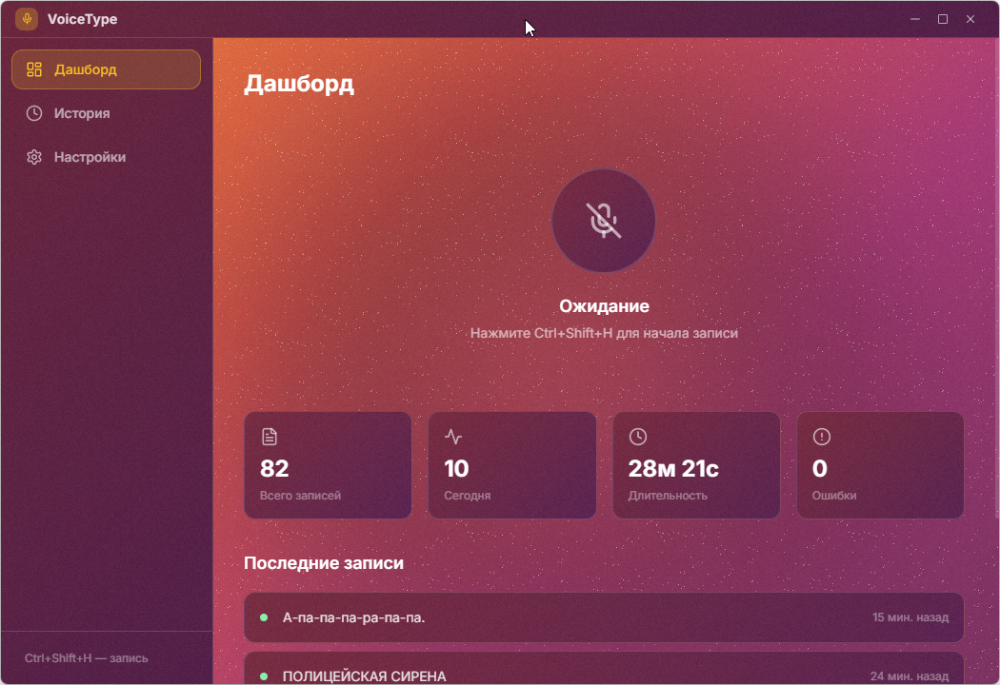

# VoiceType

Нажал горячую клавишу — сказал — текст появился там, где стоит курсор. Работает в любом приложении на Windows.



Распознавание через Whisper API (OpenAI или OpenRouter). Записи сохраняются в историю — можно переслушать, скопировать, вставить повторно.

## Установка

Скачать [VoiceType-Setup.exe](https://github.com/kirill-kopylov/voice-type/releases/latest) и запустить. При первом запуске указать API-ключ в настройках.

## Разработка

```bash
npm install
npm run dev      # dev с hot reload
npm run dist     # собрать установщик
```
