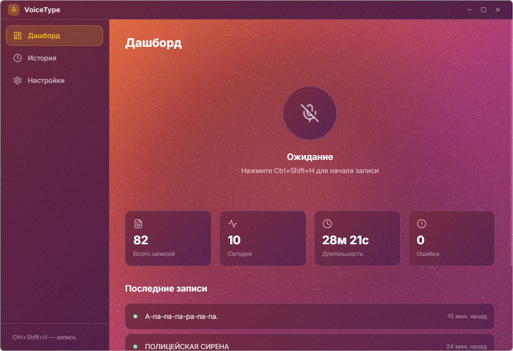

# VoiceType

Нажал горячую клавишу — сказал — текст появился там, где стоит курсор. Работает в любом приложении на Windows.



Распознавание через Whisper API (OpenAI или OpenRouter). Записи сохраняются — можно переслушать, скопировать, вставить повторно.

## Установка

Скачать [VoiceType-Setup.exe](https://github.com/kirill-kopylov/voice-type/releases/latest) и запустить. При первом запуске указать API-ключ в настройках.

## Как пользоваться

1. Открой любое приложение и поставь курсор в текстовое поле
2. Нажми **Ctrl+Shift+H** — услышишь звуковой сигнал, в углу экрана появится индикатор с визуализацией голоса
3. Говори
4. Нажми **Ctrl+Shift+H** ещё раз — второй сигнал, индикатор переключится на анимацию обработки
5. Через пару секунд распознанный текст вставится в поле автоматически

Приложение работает в фоне из системного трея. Окно можно закрыть — запись по горячей клавише продолжит работать.

## Возможности

- **Запись из любого приложения** — глобальная горячая клавиша работает поверх всего
- **Автовставка** — текст сразу появляется там, где курсор. Работает в браузерах, мессенджерах, IDE, терминалах
- **История** — все транскрипции сохраняются. Можно искать по тексту, переслушивать аудио, копировать или вставлять повторно
- **Два провайдера** — OpenAI и OpenRouter, переключается в настройках

## MCP-сервер для нейроагентов

Настройки → «MCP-сервер для нейроагентов» → включить. Приложение поднимает локальный сервер
`http://127.0.0.1:47321/mcp` (только этот компьютер, токен в `Authorization: Bearer`). В настройках
есть готовая команда для Claude Code и JSON-конфиг для остальных клиентов.

| Инструмент | Что делает |
|---|---|
| `digest` | что было по дням: встречи с саммари и решениями, счётчики диктовок (по умолчанию 7 дней) |
| `list_meetings` | встречи без стенограмм: период, участник, слова, есть ли заметки/саммари, сортировка, страницы |
| `get_meeting` | саммари + заметки; стенограмма по запросу (диапазон секунд, спикер, лимит символов) |
| `search` | нечёткий или точный поиск по диктовкам, саммари, репликам и заметкам с фильтрами по дате, типу, спикеру |
| `list_dictations` / `get_dictation` | диктовки с превью и полный текст |
| `add_meeting_note` / `update_meeting_note` / `delete_meeting_note` | заметки агента к встрече (что сделано, ссылки на задачи); заметки пользователя агент менять не может |

Даты везде: `2026-10-05`, `2026-10` (месяц), `today`, `yesterday`, `7d`, `2w`. Свои заметки к встрече
пользователь добавляет в карточке встречи; агентские помечены значком робота.

## Разработка

```bash
npm install
npm run dev      # dev с hot reload
npm test         # vitest: поиск, даты, запросы MCP
npm run dist     # собрать установщик
```
